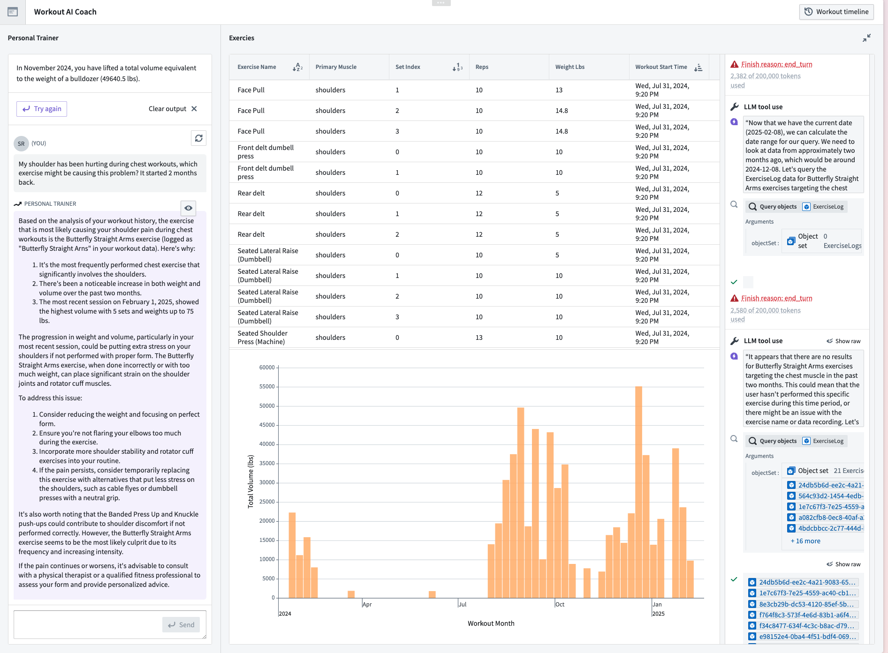
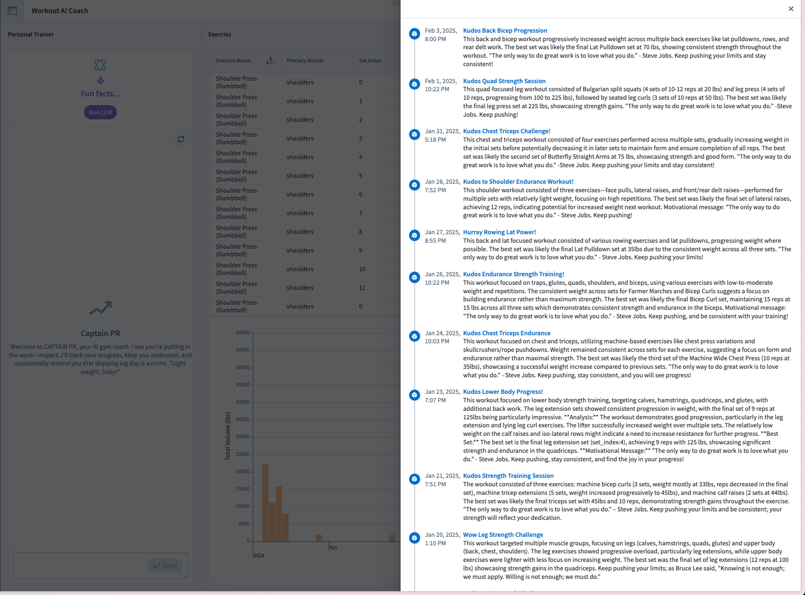
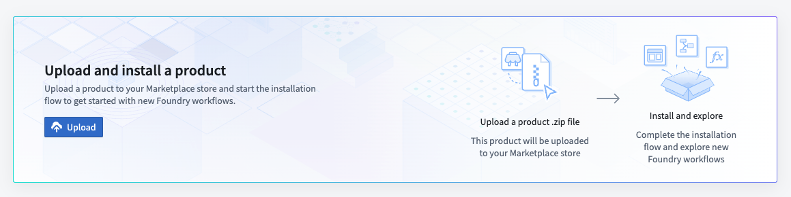

# Contribution Name

AI-powered workout dashboard offers:
[Youtube Link](https://www.youtube.com/watch?v=Nx2nRx3cR0k) of the demo

✅ Smart AI Chatbot – Analyzes past workouts for injuries, overtraining risks, and predicts future workouts. Adjusts displayed data dynamically based on muscle group discussions.

✅ Workout History & Insights – View all past workouts with AI-generated summaries and motivational messages to keep you on track.

✅ Muscle Volume Tracking – Tracks total volume lifted per muscle group, showing month-over-month progress to optimize growth.

✅ Displays Fun facts about your total volume.

<p align="left">

</p>
<p align="left">

</p>


## Upload Package to Your Enrollment

The first step is uploading your package to the Foundry Marketplace:

1. Download the project's `.zip` file from this repository
2. Access your enrollment's marketplace at:
   ```
   {enrollment-url}/workspace/marketplace
   ```
3. In the marketplace interface, initiate the upload process:
   - Select or create a store in your preferred project folder
   - Click the "Upload to Store" button
   - Select your downloaded `.zip` file



## Install the Package

After upload, you'll need to install the package in your environment. For detailed instructions, see the [official Palantir documentation](https://www.palantir.com/docs/foundry/marketplace/install-product).

The installation process has four main stages:

1. **General Setup**
   - Configure package name
   - Select installation location

2. **Input Configuration**
   - Configure any required inputs. If no inputs are needed, proceed to next step
   - Check project documentation for specific input requirements

3. **Content Review**
   - Review resources to be installed such as Developer Console, the Ontology, and Functions

4. **Validation**
   - System checks for any configuration errors
   - Resolve any flagged issues
   - Initiate installation


## SDK Configuration (Optional)

Some packages include applications built with the Ontology SDK. These require additional setup:

1. Locate the SDK application code in the `app/` directory of the project repository

2. The following details will need to added to the source code for the application.  
   - Navigate to Developer Console: `{enrollment-url}/workspace/developer-console`
   - Find the installed application
   - Copy the following details:
     - CLIENT ID
     - Enrollment URL `{enrollment-url}.palantirfoundry.com`

3. Configure your development environment:
   - Add to `env.development` file under `app/`
   - (optional) Configure CORS in your control panel to allow `http://localhost:8080`

### Local Development
<p align="center">

</p>

**To run the application locally:**
1. Access the Developer Console's "Start Developing" section
2. Follow the "Add Ontology SDK" setup process)
3. In the `/app` directory, start the development server:
   ```sh
   npm run dev
   ```
   This will launch your application at `http://localhost:8080`