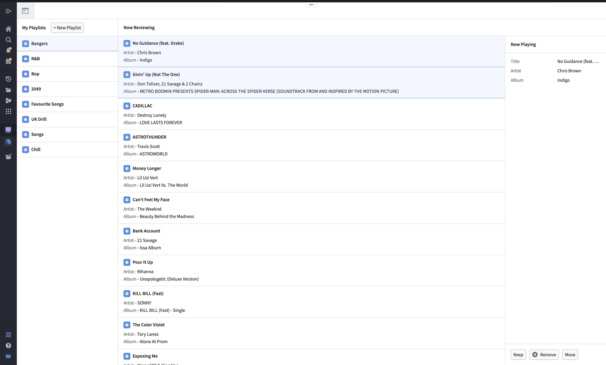
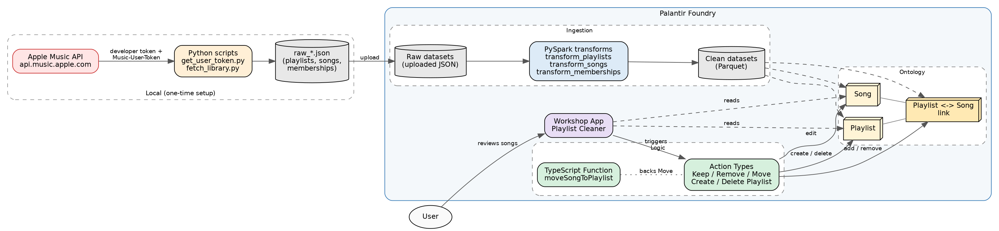
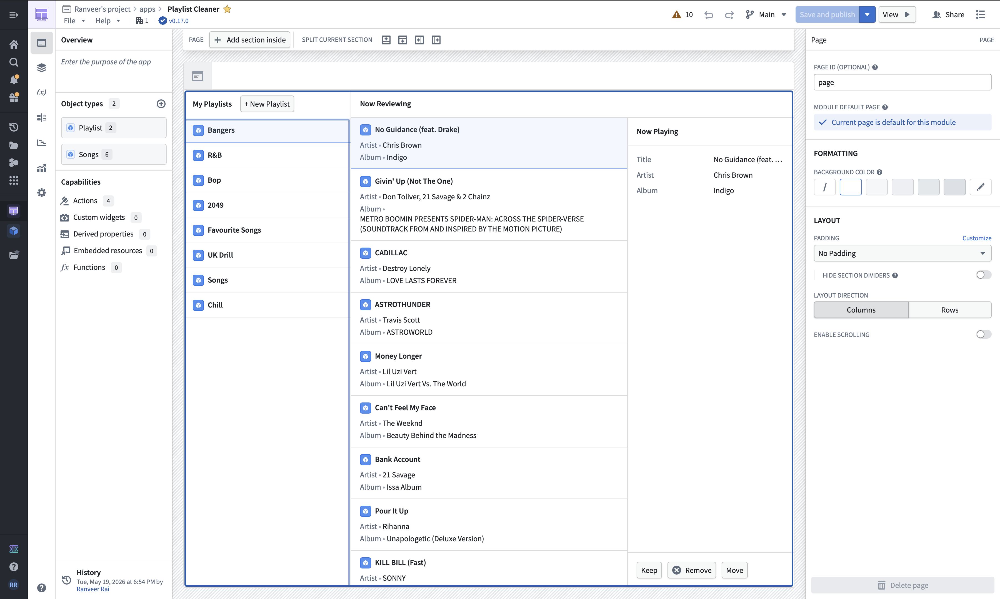

# Apple Music Playlist Cleaner

A Foundry-native app for reviewing and reorganizing Apple Music libraries one song at a time. Built as a reference implementation for the AIP Community Registry.

[](https://youtu.be/8epo-1eSRuo)

> **Watch the 3-minute demo:** https://youtu.be/8epo-1eSRuo

---

## What it does

Music libraries grow until they're unusable. This app pulls every playlist and song from an Apple Music account into Foundry, then gives you a one-song-at-a-time review UI: **Keep**, **Remove from playlist**, or **Move to another playlist**. You can also create new playlists and delete the ones you create.

The point isn't to be a polished consumer product. It's to show how an everyday problem maps cleanly onto Foundry primitives: JSON ingestion, ontology objects with a many-to-many link type, AIP Actions, and a function-backed multi-step write.

The reference dataset is one real Apple Music library: **11 playlists, 2,335 unique songs, 2,927 playlist-song memberships.**



---

## Architecture



**The flow:**

1. Two local Python scripts handle Apple auth and extraction. `get_user_token.py` runs a local MusicKit JS page to capture a Music-User-Token; `fetch_library.py` uses that token to pull playlists, songs, and memberships into `raw_*.json` files.
2. Those JSON files are uploaded into Foundry as raw datasets.
3. Three PySpark transforms — `transform_playlists`, `transform_songs`, `transform_memberships`, all in `pipelines/transforms.py` — read the raw JSON and write clean Parquet datasets.
4. The clean datasets back three ontology types: `Song`, `Playlist`, and a many-to-many `Playlist <-> Song` link.
5. Action Types let users edit the ontology. Simple ones (Remove, Create Playlist, Delete Playlist) wrap a single ontology edit. The Move action is backed by a TypeScript Function because it needs two operations (delete the source link, add the target link) in one submission.
6. The Workshop app reads the ontology and triggers actions on button clicks.



---

## Ontology

| Type | Primary key | Properties |
|------|-------------|------------|
| `Song` | `song_id` | title, artist, album, duration_ms, apple_music_url, artwork_url |
| `Playlist` | `playlist_id` | name, description, last_modified, song_count, is_user_created, created_at |
| `Playlist <-> Song` (link) | composite | Backed by `playlist_song_membership`; columns `left-Song-primary-key` / `right-Playlist-primary-key`; deduplicated on the composite key |

Full property and link definitions are in [`ontology/schema.md`](./ontology/schema.md).

The `is_user_created` flag separates playlists made in the app (`true`) from ones synced in from Apple Music (`null` on ingested rows). The Workshop app uses it to hide the Delete button on synced playlists, so a user can't try to delete real Apple Music data from an app that doesn't write back to Apple.

---

## Actions

| Action | Type | Backed by |
|--------|------|-----------|
| Keep | Modify object | Single ontology edit |
| Remove from Playlist | Delete link | Single ontology edit |
| Move to Playlist | Modify link | TypeScript Function (`moveSongToPlaylist`) |
| Create Playlist | Create object | Single ontology edit; auto-fills `is_user_created` and `created_at` |
| Delete Playlist | Delete object | Single ontology edit; gated by conditional visibility |

Move is the interesting one. A Workshop button triggers a single ontology operation per click, and Move needs two (remove from source, add to target). The fix is a small TypeScript Function (`moveSongToPlaylist`) that wraps both edits in one action submission via an edit batch.

---

## Repository layout

```
apple-music-playlist-cleaner/
├── README.md
├── LICENSE
├── requirements.txt
├── images/
│   ├── architecture.png          # architecture diagram
│   ├── architecture.dot          # graphviz source
│   ├── playlist_cleaner.png      # app screenshot
│   └── workshop.png              # Workshop layout screenshot
├── connector/
│   ├── apple_music_connector.py  # Apple Music REST client
│   ├── __init__.py
│   └── auth/
│       └── musickit_auth.py      # ES256 JWT developer-token generator
├── scripts/
│   ├── get_user_token.py         # local MusicKit JS page -> Music-User-Token
│   ├── fetch_library.py          # pulls library into data/raw/*.json
│   └── test_connection.py        # smoke test: JWT + catalog endpoint
├── data/
│   └── raw/                      # sample data: one real Apple Music library
│       ├── raw_playlists.json
│       ├── raw_songs.json
│       └── raw_memberships.json
├── pipelines/
│   └── transforms.py             # transform_playlists / _songs / _memberships
├── ontology/
│   └── schema.md                 # property + link type definitions
└── osdk_app/
    └── typescript-functions/     # TypeScript Functions repo (released at 0.2.0)
        ├── src/
        │   ├── functions/
        │   │   └── moveSongToPlaylist.ts
        │   └── index.ts
        ├── functions.json
        ├── package.json
        └── ...
```

> In Foundry the three transforms live in a single `transforms.py` inside the `apple_music_transforms` repository, and the connector/scripts run locally rather than inside Foundry. The layout above is how the code is organized for this submission.

---

## Requirements

- A Palantir Foundry enrollment.
- An Apple Developer account with MusicKit enabled.
- Python 3.11+ for the local connector and scripts. Dependencies are in `requirements.txt` (`PyJWT`, `requests`, `python-dotenv`).
- Node.js for the TypeScript Functions (managed by Foundry when the Functions repo is deployed).

---

## A note on the Apple Music auth boundary

This is a **single-user reference implementation**. It does not write changes back to Apple Music. All Keep / Remove / Move / Create / Delete operations affect the Foundry ontology only.

This is a deliberate scoping decision driven by Apple's auth model, not a missing feature.

The Apple Music API requires **two** tokens on every personal-library request:

- A **developer token** — an ES256 JWT signed with a MusicKit `.p8` key. Server-side, safe to store as a Foundry secret. Generated by `connector/auth/musickit_auth.py`.
- A **Music-User-Token** — scoped to one user's library, only obtainable via MusicKit JS in a browser. There is no server-side flow to obtain one.

A Foundry REST API source stores one set of workspace-level credentials. It is built for service-to-service auth, not per-user OAuth where each end-user signs in with their own Apple ID and receives their own token. There is also no built-in way for a Workshop app to embed MusicKit JS, run an Apple sign-in popup, and store the resulting per-user token keyed to the Foundry user.

**To make this multi-tenant in production you would need:**

1. A custom Workshop TypeScript widget that loads MusicKit JS and triggers Apple sign-in.
2. An `ApplePlayerCredentials` ontology object keyed to the Foundry user ID, storing each user's Music-User-Token.
3. A TypeScript Function that, on each Remove / Move action, looks up the active user's token and calls `api.music.apple.com` to mirror the change back to Apple.

The Foundry-native patterns this app demonstrates — ontology modeling, link types, function-backed actions, Workshop UI composition — are identical whether or not the Apple write-back is wired up. Shipping the ontology-only version keeps the patterns easy to read and adapt.

This submission is a code reference implementation. It does not include a Foundry Marketplace bundle (`project_file.zip`); the ontology, actions, and Workshop app are documented here and in the demo video for reviewers to recreate or adapt.

---

## Installation and configuration

You'll need a Foundry enrollment, an Apple Developer account with MusicKit enabled, and the ability to capture a Music-User-Token for your own library.

### 1. Apple credentials

In the [Apple Developer console](https://developer.apple.com/account/resources/identifiers/list/mediaId):

- Create a **Media ID** — this is the correct identifier type for MusicKit (not an App ID or a Services ID).
- Generate a **MusicKit private key**, download the `.p8` file, and note the **Key ID** (10 characters).
- Note your **Team ID** (10 characters, from the account overview).

### 2. Local setup

```bash
pip install -r requirements.txt
```

Create a `.env` file in the project root (it is gitignored — never commit it):

```
APPLE_TEAM_ID=your_team_id
APPLE_KEY_ID=your_key_id
APPLE_PRIVATE_KEY_PATH=connector/auth/AuthKey_<KEY_ID>.p8
```

Verify the developer token works:

```bash
python3 scripts/test_connection.py
```

### 3. Capture your Music-User-Token

```bash
python3 scripts/get_user_token.py
```

This generates a fresh developer token, serves a local MusicKit JS page, and opens it in your browser. Sign in with your Apple ID, copy the token it prints, and add it to `.env`:

```
APPLE_MUSIC_USER_TOKEN=your_music_user_token
```

Treat this token like a password.

### 4. Extract your library

```bash
python3 scripts/fetch_library.py
```

This writes `data/raw/raw_playlists.json`, `raw_songs.json`, and `raw_memberships.json`. Sample versions of these files (one real library) are included so you can inspect the expected shape.

### 5. Foundry setup

1. Upload the three `raw_*.json` files into Foundry as raw datasets.
2. Create a Code Repository, add `pipelines/transforms.py`, and point the `Input`/`Output` RIDs at your datasets.
3. Build the transforms to produce the clean `playlists`, `songs`, and `playlist_song_membership` datasets.
4. Using `ontology/schema.md`, create the `Song`, `Playlist`, and `Playlist <-> Song` link types, each pointing at its backing dataset.
5. Deploy `osdk_app/typescript-functions/` as a Foundry Functions repository and create the Action Types as shown in the demo video.
6. Build the Workshop app: two object lists (playlists, and songs filtered by link to the active playlist), a property list for the active song, and the Keep / Remove / Move / Create / Delete buttons.

---

## Usage

Once the Workshop app is built, the workflow is:

1. Pick a playlist from the list on the left.
2. Review songs one at a time in the center panel.
3. For each song, click **Keep** (advance), **Remove** (drop it from this playlist), or **Move** (send it to another playlist).
4. Use **+ New Playlist** to create a playlist, then Move songs into it.
5. **Delete Playlist** removes a playlist you created — it is hidden on playlists synced from Apple Music.

The demo video walks through the full flow, including creating a playlist, moving songs into it, and deleting it.

---

## Status and future work

Implemented and demonstrated in the video: ingestion, the three-type ontology, all five Action Types, and the Workshop review UI.

Not implemented:

- **Keyboard shortcuts.** A custom TypeScript widget for K/R/M shortcuts was scoped but not built. It would follow the same Functions-backed pattern as the Move action.
- **Apple Music write-back.** Out of scope by design — see the auth-boundary section above.

---

## What I'd do differently next time

- **Set up the TypeScript Functions repo before building any actions.** I built the Remove action first as a simple link-delete, hit the Move problem (two ops, one button), then had to backtrack to stand up Functions. Functions unblock multi-step actions, keyboard shortcuts, and computed values all at once. Plan for them on day one.
- **Add `is_user_created` to the Playlist type from the start.** I added it late, so ingested playlists carry `null` instead of `false`. The conditional-visibility logic still works (`null != true`), but it's tidier to have the schema right up front.
- **Treat the Apple Music auth boundary as a design constraint on day one.** I started setting up a Foundry REST API source before realizing the per-user Music-User-Token requirement makes multi-tenant auth a non-starter without a custom widget. Reading Apple's MusicKit docs first would have saved a working session.

---

## License

MIT — see [LICENSE](./LICENSE).