# WhatsApp Integration for Palantir Foundry
*by Jay Ambadkar*

You can find a video demo of this [here: https://youtu.be/Wob3POAS6ps](https://youtu.be/Wob3POAS6ps). Feel free to leave a like if you enjoy it!

All data is notional.

Features: 
- Receive messages from a WhatsApp Business account into AIP 
- Send messages from within Foundry
- Add your own custom automations, leverage AIP and all the good things you can do with the Ontology

As well as providing a download for the demo's application, this repo provides a standalone download for the WhatsApp integration component of that demo. Please let me know if anything remains unclear or if you are having issues with getting it to work.

Note that the demo app also requires non-trivial setup to make it function as shown, but that is all contained in the instructions below.

To install as much as you can of my main demo, use the `./whatsapp-integration.mkt.zip` file and adapt the instructions below as necessary.

## Contents
- [High-level Overview](#high-level-overview)
- [Provided in this repo](#provided-in-this-repo)
- [Prerequisites](#prerequisites)
- [Installation](#installation)
  - [Stage 1: Meta Cloud API Configuration](#stage-1-meta-cloud-api-configuration)
  - [Stage 2: Streams Dataset in Foundry](#stage-2-streams-dataset-in-foundry)
  - [Stage 3: Forwarding Server Installation](#stage-3-forwarding-server-installation)
  - [Stage 4: Streams Pipeline Setup](#stage-4-streams-pipeline-setup)
  - [Stage 5: Create the Necessary Data Connection](#stage-5-create-the-necessary-data-connection)
  - [Stage 6: Create and Deploy Compute Module](#stage-6-create-and-deploy-compute-module)
- [All done!](#all-done)
- [Support](#support)

## High-level Overview

The integration follows this data flow:
1. **Inbound Messages**: WhatsApp -> Forwarding Server -> Foundry Streams -> Dataset
2. **Outbound Messages**: Foundry Compute Module -> WhatsApp Business API -> User

> Note that a *WhatsApp Business account* is required for this.

## Provided in this repo
All instructions for setup given below - you will need to configure for your environment.

### 1. Forwarding Server (`forwarding-server/`)
A Flask server that receives WhatsApp messages via Meta webhook and forwards them to a Streams dataset in Foundry via OSDK webhook.

### 2. WhatsApp Bot Compute Module (`wa-bot-compute-module/`)
A Node.js compute module that sends outbound WhatsApp messages via the Meta Cloud API.

### 3. (Not prebuilt) Foundry Streams Dataset
This is something that cannot be pre-provided practically. I will here guide you through the process of setting up your own in Foundry. It's reasonably straightforward.

### 4. Streams Pipeline 
Pre-made streaming pipeline for operationalising direct messages received by your WhatsApp Business account.

### 5. Ontologisation
Instructions not provided for this part, but essentially ensure everything you've added is Ontologised for maximum integration. E.g. messages received become an object, send functions are actions, automations take place where appropriate, etc.


**YOU SHOULD DOWNLOAD THIS REPO BEFORE CONTINUING. EITHER CLONE THE ENTIRE REPO OR JUST DOWNLOAD THIS DIRECTORY AND EXTRACT.** This is optional but will make your life easier when following this guide.


## Prerequisites

Before starting the installation, ensure you have:

- Admin access to your Foundry environment, or the ability to get your changes approved.
- [Meta/Facebook](https://developers.facebook.com/apps/?show_reminder=true) Business account with WhatsApp Business API access. You can use either a Meta assigned developer phone number (free) or your own WhatsApp Business account number (the former comes with restrictions).

From personal experience, it is much easier to gain access to the Meta Cloud API control panel than to know what to do with it.


# Installation

## Stage 1: Meta Cloud API Configuration

Under the directory `/setup-images` there are screenshots corresponding to the following steps, labelled "^2[abe].*" (this is a regex pattern but spotting the real thing isn't too bad).

1. **Access Meta Developer Console**
   - Go to [developers.facebook.com](https://developers.facebook.com)
   - Log in with your Meta Business account
   - Create a new app or select an existing business app

2. **Add WhatsApp Product**
   - In your app dashboard, click "Add Product"
   - Select "WhatsApp" and click "Set Up"
   - Set it up, either with a free but restricted dev account or your WhatsApp Business account

3. **Configure Phone Number**
   - Navigate to WhatsApp > API Setup
   - Add and verify your business phone number
   - Note your Phone Number ID and Business Account ID

4. **Generate Access Token**
   - Go to [Facebook Business Account Manager to create a system user](https://business.facebook.com/settings/system_users)
   - Create a system user
   - Generate a token
        - Give it the app name as you created earlier
        - Expiration = never
        - Grant all the permissions for WhatsApp Business
        - Generate and obtain token
   - Keep this token safe
   - Note down your WhatsApp Business Account ID

### Message Templates Setup

You need to create message templates for outbound communication. 

This is akin to the "prompts" and "updates" demonstrated in my video, and is quite a key feature of this setup (you are very limited in when you can send freeform messages - only within 24h of a user messaging you directly).

Either copy what I've done exactly (the existing compute module will align exactly) otherwise you will need to adjust the compute module, described later. If you choose the latter, you can also bring in templates from the large templates library, but each you use will need a function written for it to make it operable within Foundry.

1. **Create Templates**
   - Go to [WhatsApp > Message Templates](https://business.facebook.com/latest/whatsapp_manager/message_templates)
   - Create the following templates:

   **Template 1: "order_update"**
   - See `setup-images/2f-message-template-1.jpg`
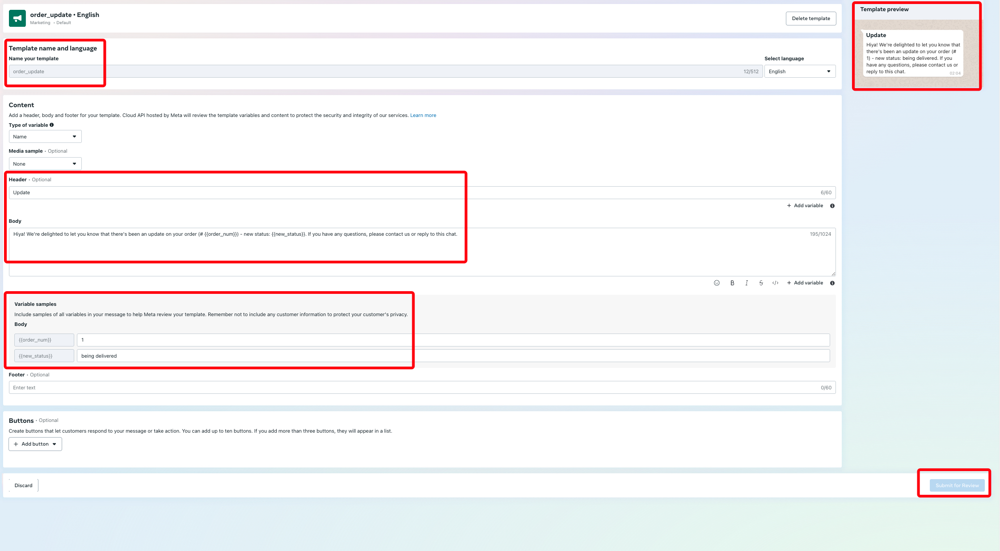

   **Template 2: "inform_intent"**
   - - See `setup-images/2g-message-template-2.jpg`
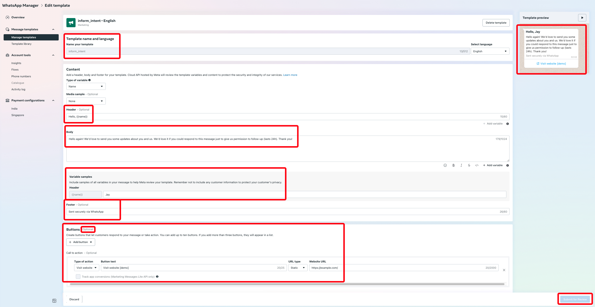

2. **Template Approval**
   - Submit templates
   - They should be ready to use basically immediately

Ensure language is set to just "English", not any of the variants. This gives the language code as just "en", which is what the compute module is preconfigured to.

### Webhook Setup
We'll do this once the Streams dataset is all good to go.

## Stage 2: Streams Dataset in Foundry
Create the Streams dataset to receive WhatsApp messages into. This corresponds to pictures "^1[a-f].*" in `/setup-images`.

1. Create a Streams Dataset in your Foundry project.
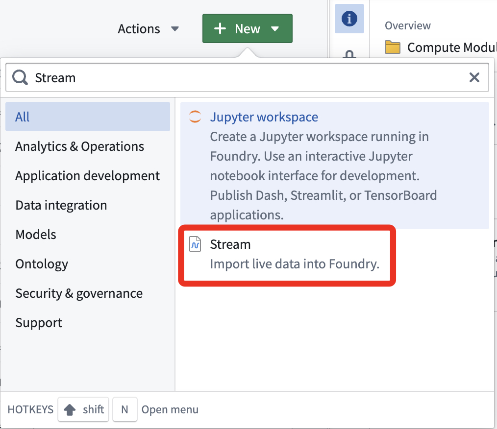

2. Set the schema, use the "generate from JSON" feature using the below JSON
```json
{
  "object": "whatsapp_business_account",
  "entry": [
    {
      "id": "<WHATSAPP_BUSINESS_ACCOUNT_ID>",
      "changes": [
        {
          "value": {
            "messaging_product": "whatsapp",
            "metadata": {
              "display_phone_number": "<BUSINESS_DISPLAY_PHONE_NUMBER>",
              "phone_number_id": "<BUSINESS_PHONE_NUMBER_ID>"
            },
            "contacts": [
              {
                "profile": {
                  "name": "<WHATSAPP_USER_NAME>"
                },
                "wa_id": "<WHATSAPP_USER_ID>"
              }
            ],
            "messages": [
              {
                "from": "<WHATSAPP_USER_PHONE_NUMBER>",
                "id": "<WHATSAPP_MESSAGE_ID>",
                "timestamp": "<WEBHOOK_SENT_TIMESTAMP>",
                "text": {
                  "body": "<MESSAGE_BODY_TEXT>"
                },
                "type": "text"
              }
            ]
          },
          "field": "messages"
        }
      ]
    }
  ]
}
```
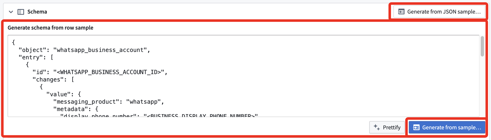

3. Set throughput to normal

4. Continue and save. Then set up authentication with "Push with a 3rd party application". Follow the steps to obtain a Foundry token you can use with the Flask server below. If you're in a rush, just use a personal token for now, e.g. for testing/dev purposes.

5. Obtain a Foundry URL using one of the methods at the bottom of the page. All you need is something that looks like the following.

```
https://<YOUR_FOUNDRY_URL>/api/v2/highScale/streams/datasets/<DATASET_RID>/streams/master/publishRecords?preview=true
```

Now note both this URL and the token for the next stage.

## Stage 3: Forwarding Server Installation

The forwarding server acts as a bridge between WhatsApp webhooks and Foundry Streams. This automates and simplifies the process of getting your messages into Foundry.

> N.B. If you have access to [Listeners](https://www.palantir.com/docs/foundry/data-connection/listeners-overview#inbound-connections) and sufficient domain knowledge, I'd strongly recommend investigating using these for this stage instead of the Flask server described.

> Unfortunately, Listeners is in Beta at time of writing and I don't have access but they seem perfect for this job, though you'd need at least some domain knowledge to get it working as I can't provide detailed instructions for this.

### Setup the server
1. **Environment Configuration**
   Create a `.env` file with the following variables:
   ```bash
   FOUNDRY_URL=<STREAMS_URL_OBTAINED_ABOVE>
   FOUNDRY_TOKEN=<STREAMS_TOKEN_OBTAINED_ABOVE>
   VER_TOKEN=<MY_SECRET_STRING>
   ```
   Put this in `/forwarding-server`

2. Make sure `hermes.py` is in the same directory, then run it. Deploy it somewhere if you can so it has a public URL. If running for dev purposes, then expose the endpoint using ngrok or similar. 

3. **Configure WhatsApp Webhook**
   - Go back to Meta Developer Console
   - Navigate to WhatsApp > Configuration
   - Add your webhook URL: `https://<YOUR_DEPLOYED_URL>/webhook` as the callback URL
   - Use your `VER_TOKEN` for verification
   - Subscribe to message events
   
   See the following pictures for the exact process
   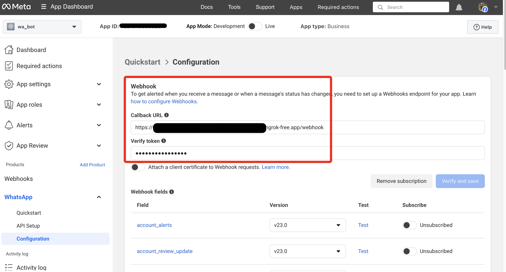
   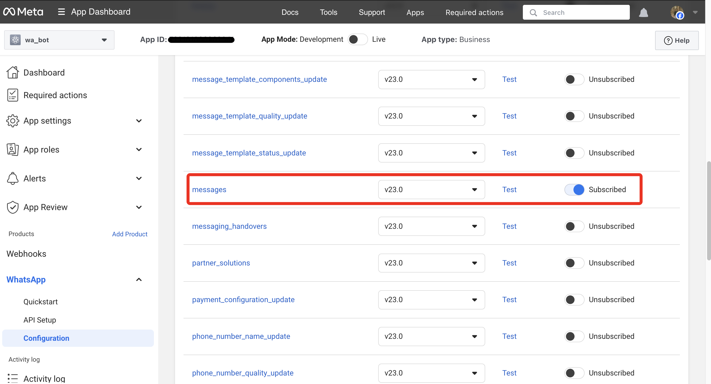

Now run the Flask server and send a few messages to your configured WhatsApp Business account. They should appear in your Streams dataset.

## Stage 4: Streams Pipeline Setup
Here we need to turn the data ingested in Streams into Ontology objects so you can use it.

This is a far more routine Foundry process, so if you feel confident enough then just do this without necessarily following the steps below. In any case, make sure the pipeline you create is a **streaming** pipeline.

1. Add the provided pipeline into your Foundry configuration. It is at `./streams-pipeline-only.mkt.zip` in this repo. You can install it into your instance and use it in your project by following [these instructions](https://github.com/palantir/aip-community-registry/blob/develop/INSTALLATION.md).
2. Edit the pipeline to add the input being your Streams dataset as set up above. Save and deploy. You may want to rename the output dataset.
3. **Ontologise:** Create a new Ontology object and back it using the output dataset. If you get stuck, ask AIP assist as this is quite an idiomatic Foundry operation.

You should now be good to go and messages should be received cleanly into Foundry and visible in your object explorer! If this doesn't happen, please review the above steps and try again or see the support section at the bottom of this readme.

## Stage 5: Create the Necessary Data Connection
As the Meta/Facebook Cloud API sits outside of Foundry, you'll need to create a Data Connection. This will also be populated with the credentials needed for the Compute Module.

This matches up with "^3[a-fi].*" of the images at `./setup-images`.

1. Create new Data Connection
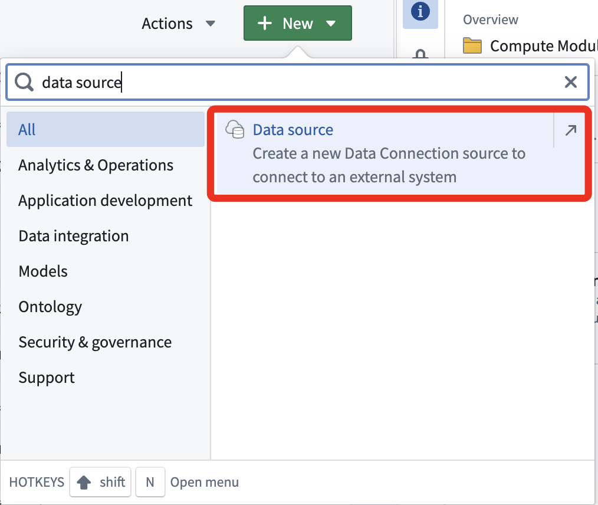
2. Set sources
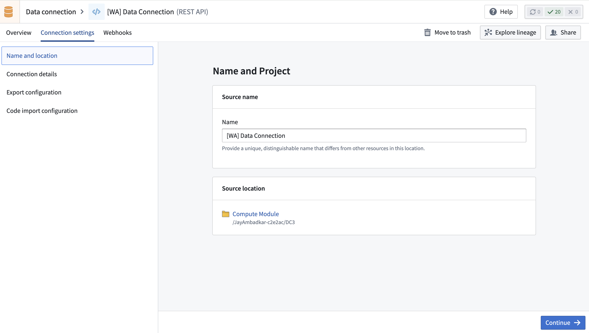
3. Set secrets (i.e. our WhatsApp credentials obtained earlier). Ensure the API names match **identically**.
  - Use the data obtained during setup of the Meta Cloud API in stage 1.
  - `additionalSecretWaAccountId=<WhatsApp_Business_Account_Id>`
  - `additionalSecretWaApiToken=<System_User_Access_Token>`
  - `additionalSecretWaPhoneNumId=<WhatsApp_Phone_Number_Id>`
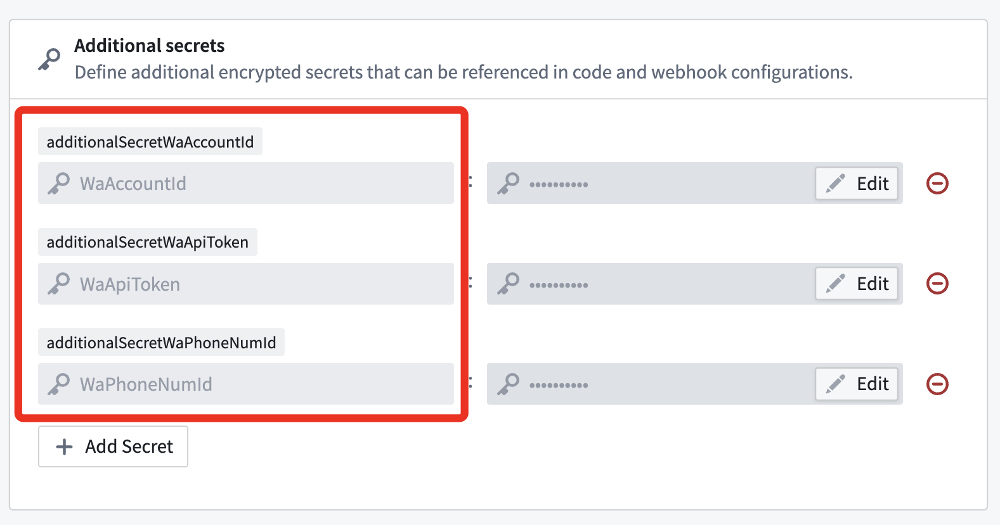
4. Set network connectivity
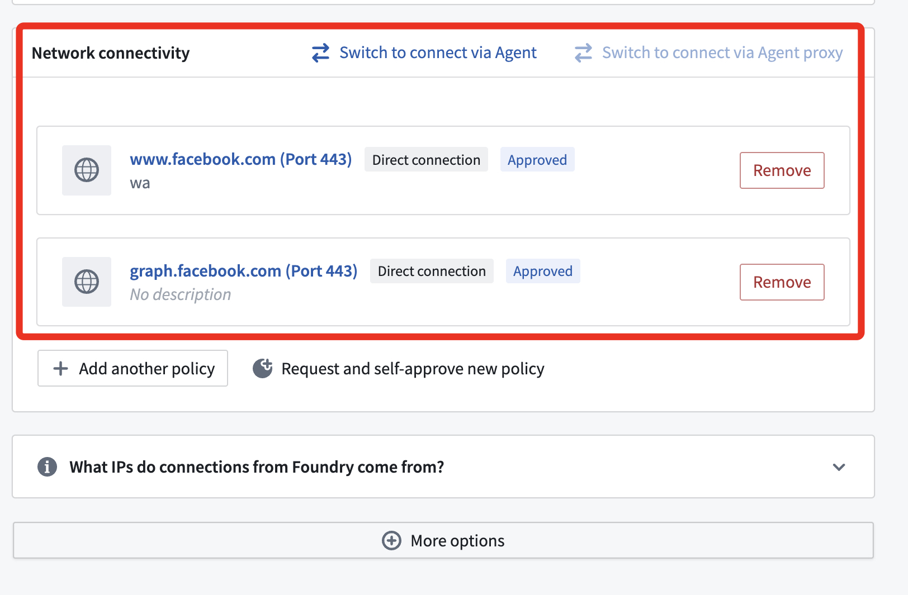
5. Set data connection export settings
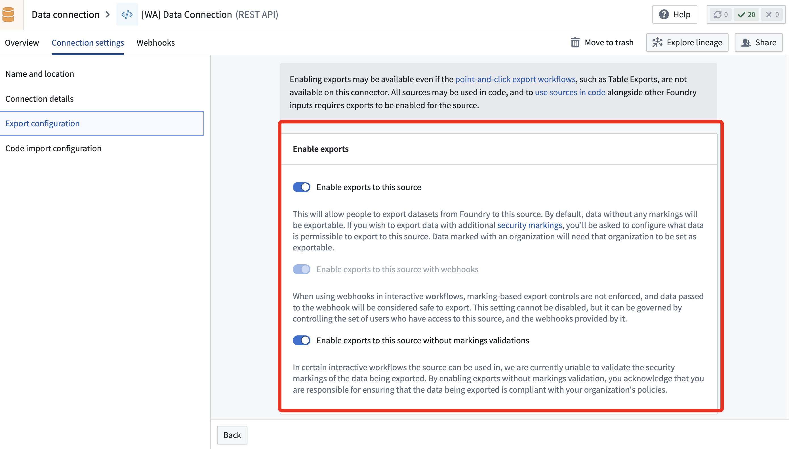
6. Set code import settings for the data connection
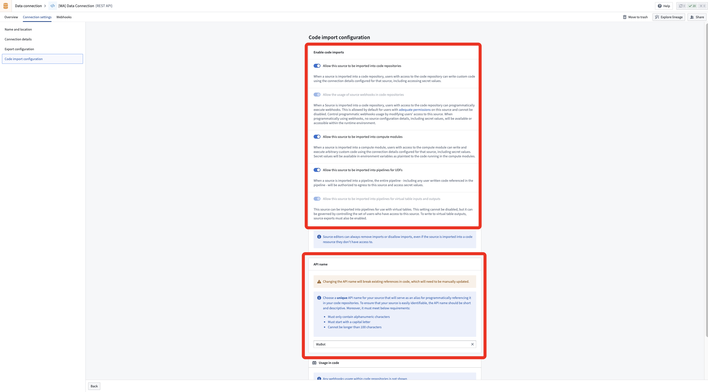

## Stage 6: Create and Deploy Compute Module
This allows you to send messages using the WhatsApp Cloud API.

1. **Local Testing Setup**
   ```bash
   cd wa-bot-compute-module
   npm install
   ```

   - If you're not sticking precisely to the functions I used in my demo (i.e. `SendMessage`, `SendPrompt`, `SendUpdate`), and added these in Stage 1 to your WhatsApp Templates control panel, then you must amend the Compute Module code to reflect this.
   - In practice, this will just involve copy-pasting all of the code relating to `SendUpdate` and changing it so that it fits with your new template. This should be easy and quick with an LLM, or even manually. Make sure to add this as a test under `test.js` later to make sure it works!!
   - Remember to set up any modifications for the Compute Module
   - Other than actually writing the function, you'll need to ensure the following are all set
       - The function schema. This is to help allow detection of function in Foundry. Examples already exist and look a little like this
       ```javascript
       const send_update_schema = {
           input: Type.Object({
               order_num: Type.String(),
               new_status: Type.String(),
               recipient_number: Type.String(),
           }),
           output: Type.Boolean(),
       };
       ```
       - Register everything you've changed (and delete anything outdated) in the compute module registration towards the end of `index.js`. Use identical patterns to what's already there.
       - Add your new functions to the exports at the bottom, then import into `test.js`. Then write real tests to check you receive the messages on your phone (and maybe someone else's as well).
       - When writing these, make sure your inputs are consistent with the function too.

2. **Configure Test Environment**
   Create a `.env` file for local testing:
   ```bash
   WA_BUSINESS_ACCOUNT_ID=your-business-account-id
   WA_PHONE_NUMBER_ID=your-phone-number-id
   CLOUD_API_ACCESS_TOKEN=your-whatsapp-access-token
   TEST_NUM=eg-your-own-phone-number-with-whatsapp
   ```
> The test number need not be a business account. Just make sure that if using dev version of Meta API (i.e. the one with restrictions) then this number is added to the list of permitted outbound numbers. No such restriction exists for fully-fledged accounts.


3. **Run Local Tests**
   ```bash
   npm test
   ```
   - This will send test messages to verify your WhatsApp API configuration
   - Ensure you've sent a message from the test number within 24 hours for the freeform messages to be received.
   - You should receive the messages practically instantly

4. **Create Artifact Repository**
   - In Foundry, navigate to Artifacts
   - Create a new NPM artifact repository
   - Upload the entire `wa-bot-compute-module` directory by following the instructions there.
   - (Just copy-paste what they say into Terminal, though you may need Docker installed)
   - Appropriately tag and name your Artifact repo when uploading
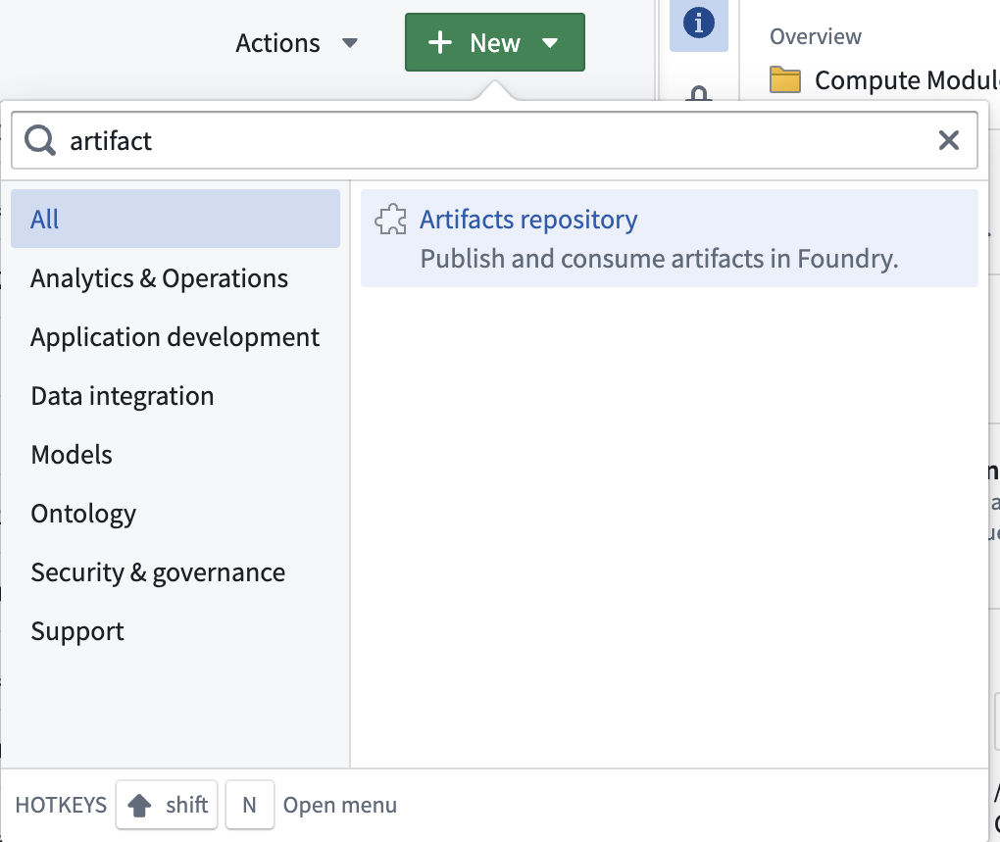

5. **Create Compute Module**
   - Create a new Compute Module as a "Functions Module" then go to configurations
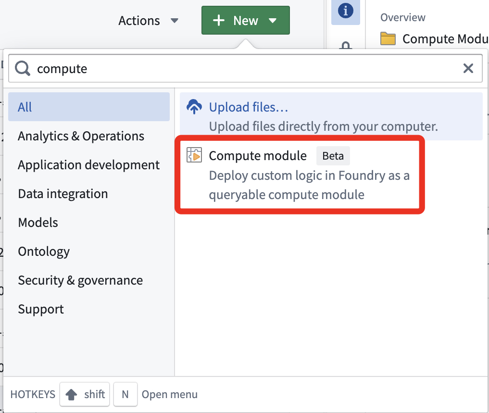

6. **Configure Compute Module**
   - Add the Artifact you just uploaded containing the Compute Module as a "Container"
   - Also add the Data Connection you wrote earlier as a "Source"
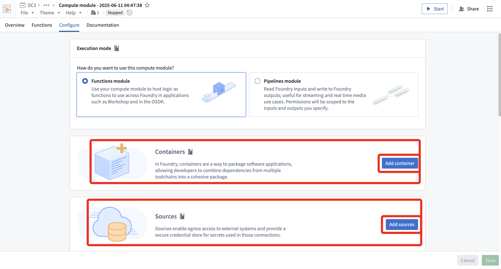

7. **Function Registration**
   The module exposes three main functions, which you will need to import:
   - `SendMessage`: Send simple text messages
   - `SendPrompt`: Send template-based messages
   - `SendUpdate`: Send order status updates
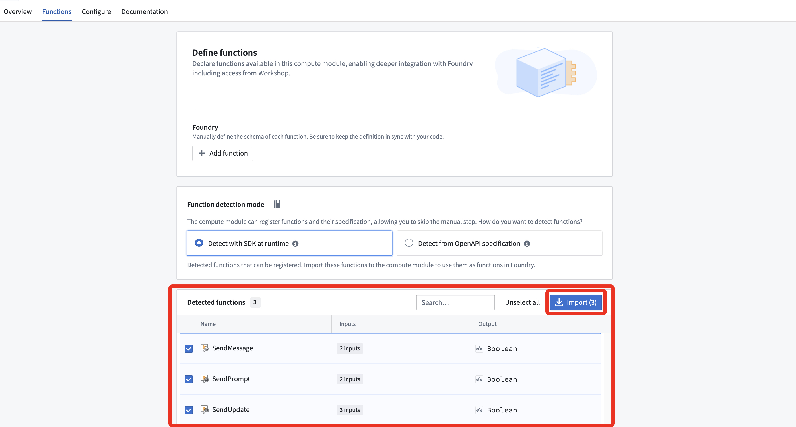

8. **Deploy and Test**
   - Deploy the compute module
   - Test each function with sample data
   - Monitor logs for any errors

## All done!
You should be ready to deploy and leverage the power of WhatsApp for Business in tandem with your Ontology now!!


### Fixing Issues

Make sure all the data you've entered corresponds to the right section, e.g. API keys, URLs, etc.

Think if your setup differs from what I used in the demo and for this guide. What changes do you need to make?

Otherwise go to the Support section for more info.

### Support

Use public documentation and AIP Assist in the first instance. Then raise an issue here or contact me if that doesn't work.
