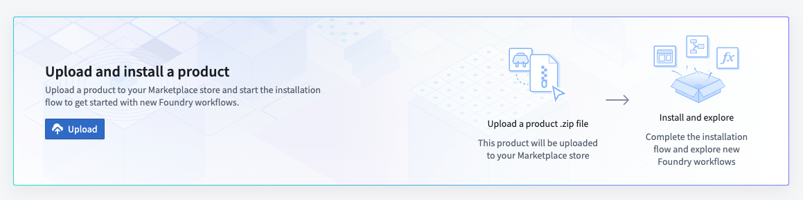

# OSDK 'Hello World' Project

## Purpose
This README provides an overview of the steps shown in *[Palantir's OSDK Using Python: Hello World Tutorial.](https://www.youtube.com/watch?v=u-XusTktitU)* In this video, Ontology Data is brought into a local Jupyter notebook using the OSDK. 

The systems used are:
- Palantir's Developer Console, with the file *OSDK - Python - HelloWorld*
- a local Jupyter Notebook file

## Upload Package to Your Enrollment

The first step is uploading your package to the Foundry Marketplace:

1. Download the project's `.zip` file from this repository
2. Access your enrollment's marketplace at:
   ```
   {enrollment-url}/workspace/marketplace
   ```
3. In the marketplace interface, initiate the upload process:
   - Select or create a store in your preferred project folder
   - Click the "Upload to Store" button
   - Select your downloaded `.zip` file



## Install the Package

After upload, you'll need to install the package in your environment. For detailed instructions, see the [official Palantir documentation](https://www.palantir.com/docs/foundry/marketplace/install-product).

The installation process has four main stages:

1. **General Setup**
   - Configure package name
   - Select installation location

2. **Input Configuration**
   - Configure any required inputs. If no inputs are needed, proceed to next step
   - Check project documentation for specific input requirements

3. **Content Review**
   - Review resources to be installed such as Developer Console, the Ontology, and Functions

4. **Validation**
   - System checks for any configuration errors
   - Resolve any flagged issues
   - Initiate installation

## Steps

### 1. Set up the Developer Console
- Install the To Do Application from the marketplace
- Create a developer console by modifying the following settings: 
  - *import the newly created "OSDK Task" object, select "Client facing application" for application type, autofill http://localhost:8080/auth/callback for the redirect url*
- Generate an SDK for conda

### 2. Set up the local Jupyter Notebook
- Run the Terminal / PowerShell commands found in the `Start Developing` tab of the Developer Console in your local terminal to set up your token and install the latest version of the sdk.
- Complete the todo tasks in the jupyter notebook, `notebook.ipynb`, then run the code. 


## Potential Foundry Features to Enable Sharing and Collaboration

- Enable an OSDK generated in Developer Console to be used in Foundry's Jupyter Notebook (*to complete Step 2 from this README*)
- In order to make API requests to Foundry, CORS must be configured for the stack to allow `http://localhost:8080` to load resources. Change this in the control panel under CORS. 