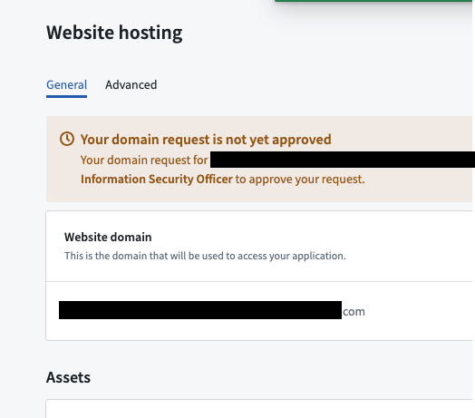
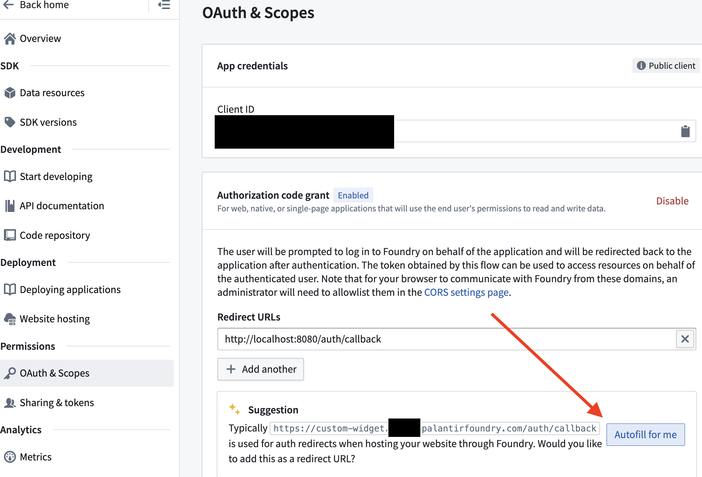
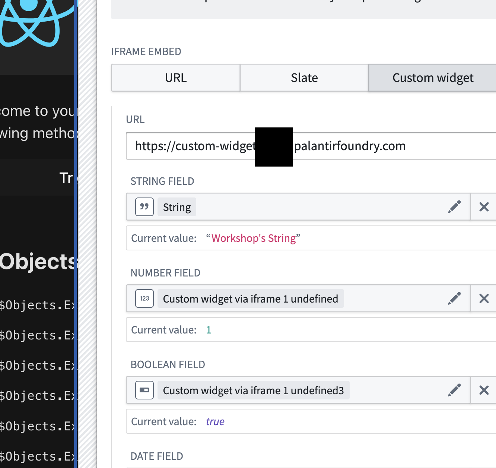

# OSDK Widget in Foundry

Create a custom widget in Workshop for whatever third party libraries or bespoke needs you wish to develop with. Comes with examples to sync different types of data data, including object sets, between workshop and the widget.

Steps
1. Upload Marketplace Bundle
2. Install downloaded sdk into prebuilt React application
3. Host it as a website (hosted application) in Foundry
4. Iframe the hosted app in Workshop.

This product was created by following this guide on the [community forum](https://community.palantir.com/t/how-to-create-a-custom-widget-for-workshop/2182).

## Upload Package to Your Enrollment

The first step is uploading your package to the Foundry Marketplace:

1. Download the project's `.zip` file from this repository
2. Access your enrollment's marketplace at:
   ```
   {enrollment-url}/workspace/marketplace
   ```
3. In the marketplace interface, initiate the upload process:
   - Select or create a store in your preferred project folder
   - Click the "Upload to Store" button
   - Select your downloaded `.zip` file


## Install the Package

After upload, you'll need to install the package in your environment. For detailed instructions, see the [official Palantir documentation](https://www.palantir.com/docs/foundry/marketplace/install-product).

The installation process has four main stages:

1. **General Setup**
   - Configure package name
   - Select installation location

2. **Input Configuration**
   - Configure any required inputs. If no inputs are needed, proceed to next step
   - Check project documentation for specific input requirements

3. **Content Review**
   - Review resources to be installed such as Developer Console, the Ontology, and Functions

4. **Validation**
   - System checks for any configuration errors
   - Resolve any flagged issues
   - Initiate installation


## SDK Configuration

Some packages include applications built with the Ontology SDK. These require additional setup:

1. Locate the SDK application code in the `app/` directory of the project repository

2. The following details will need to added to the source code for the application.  
   - Navigate to Developer Console: `{enrollment-url}/workspace/developer-console`
   - Find the installed application
   - Copy the following details:
     - CLIENT ID
     - Enrollment URL `{enrollment-url}.palantirfoundry.com`

3. Configure your development environment:
   - Add to `env.development` file under `app/`
   - (optional) Configure CORS in your control panel to allow `http://localhost:8080`

### Local Development
<p align="center">

</p>

**To run the application locally:**
1. Access the Developer Console's "Start Developing" section
2. Follow the "Add Ontology SDK" setup process)
3. In the `/app` directory, start the development server:
   ```sh
   npm run dev
   ```
   This will launch your application at `http://localhost:8080`

## Website hosting

Host this widget online using foundry hosting.

Navigate to `Website hosting` in the Custom Widget developer console app. Request a website domain which workshop can iframe. This example uses `custom-widget.<enrollment>.palantirfoundry.com`. After this has accepting, move on to deploying the react app 


Make sure you add the authorization code grant to the hosted domain.


## Deploying

Update production configuration is stored in `.env.production`.

A `foundry.config.json` file is included in the root of this project to make deploying to Foundry website hosting with [`@osdk/cli`](https://www.npmjs.com/package/@osdk/cli) easier. If you are not using Foundry website hosting for your application you may delete this file.

update it with the widget information

```json
{
  "foundryUrl": "https://<YOUR ENROLLEMENT>>.palantirfoundry.com",
  "site": {
    "application": "<SEE APPLICATION RID IN DEV CONSOLE>",
    "directory": "./dist",
    "autoVersion": {
      "type": "git-describe",
      "tagPrefix": ""
    }
  }
}

```

Navigate to the `Deploying applications` tab in the custom widget developer console app and folow the instructions there to build and deploy the react app to the new website domain you've requested. 

If you did not fill in the URL your production application will be hosted on you will need to fill in the `VITE_FOUNDRY_REDIRECT_URL` in `.env.production`. A default test is included in `env.test.ts` to verify your production environment variables which you can enable by removing the skip condition or running tests with the environment variable set `VERIFY_ENV_PRODUCTION=true`.

In order to make API requests to Foundry, CORS must be configured for the stack to allow the production origin to load resources. This will be automatically done for you if you are using Foundry website hosting. The configured OAuth client must also allow the production origin auth callback as a redirect URL.

## IFrame in Workshop

Back into your foundry enrollment, open the `Custom Widget Workshop module` that was installed with the marketplace zip file.

Input the hosted website domain where teh cusotm widget has been deployed, and configure the variables and events shared between the widget and workshop.

