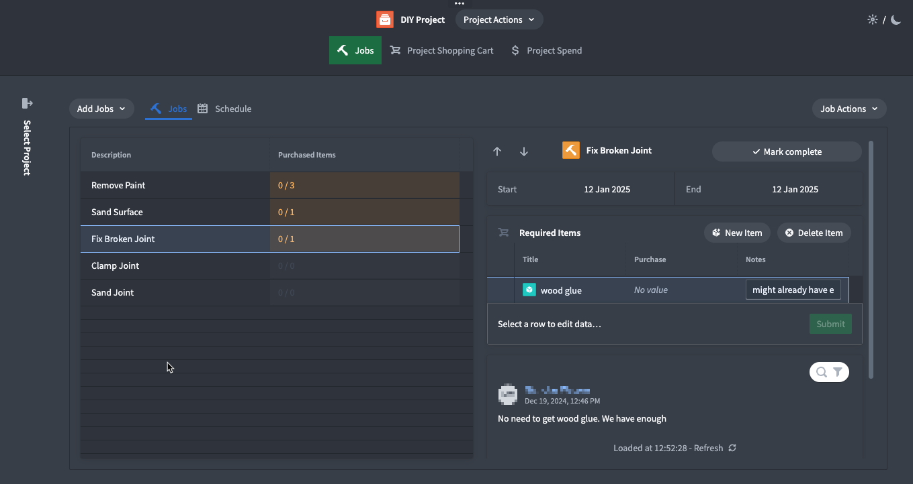

# Renovation/DIY Planner

[View the demo on YouTube](https://www.youtube.com/watch?v=dkHWuXW6Sd8)



# Overview
This application is designed to help DIY enthusiasts manage their home renovation projects efficiently. By consolidating all your tasks, materials, and schedules into one place, it simplifies project management and ensures nothing gets lost in the noise.

Or use it as a jumping-off point for developing your own application! This is a low-code example of an AIP use case and should be usable out-of-the-box without additional configuration.

## Getting Started

### Create a New Project
- Begin by creating a new project and setting a budget.

### Add Jobs
- Systematically add tasks and items that need to be completed/acquired for your project.
- Or use the "add jobs with AIP" feature to extract discrete tasks and associate relevant materials/equipment automatically from an unstructured list.

### Scheduling
- Schedule your jobs against specific days or just order them chronologically in a list view.

### Shopping Cart
- See a list of all items needed for your project against the job for which they’re needed.
- Mark items as purchased, which will update your project spend and show.

## Upload Package to Your Enrollment

The first step is uploading your package to the Foundry Marketplace:

1. Download the project's `.zip` file from this repository
2. Access your enrollment's marketplace at:
   ```
   {enrollment-url}/workspace/marketplace
   ```
3. In the marketplace interface, initiate the upload process:
   - Select or create a store in your preferred project folder
   - Click the "Upload to Store" button
   - Select your downloaded `.zip` file


## Install the Package

After upload, you'll need to install the package in your environment. For detailed instructions, see the [official Palantir documentation](https://www.palantir.com/docs/foundry/marketplace/install-product).

The installation process has four main stages:

1. **General Setup**
   - Configure package name
   - Select installation location

2. **Input Configuration**
   - Configure any required inputs. If no inputs are needed, proceed to next step
   - Check project documentation for specific input requirements

3. **Content Review**
   - Review resources to be installed such as Developer Console, the Ontology, and Functions

4. **Validation**
   - System checks for any configuration errors
   - Resolve any flagged issues
   - Initiate installation