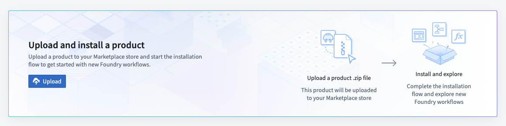

# Tailbook
 🐋

A Palantir Foundry application for tracking and visualizing whale migration patterns using the Ontology SDK (OSDK). Built during the first Foundry DevCon.

See it in action: [Video Walkthrough](https://x.com/serknight_/status/1858900717462806582/video/1)

## Tech Stack

- Frontend: React, TypeScript, Vite
- Visualization: MapboxGL
- Styling: TailwindCSS
- Backend: Palantir Foundry OSDK

## Data Sources
Configure these datasources in a pipeline, backing the ontology objects in the package. 

- [SEAMAP Duke](https://seamap.env.duke.edu/dataset/list)
- [HappyWhale](https://instagram.com/happywhale_official)
- [OBIS Network](https://x.com/obisnetwork)


## Prerequisites

- Node.js (v18+)
- Palantir Foundry instance with appropriate access
- Mapbox account (free tier works)
- NPM registry access to Foundry artifacts

## Upload Package to Your Enrollment

The first step is uploading your package to the Foundry Marketplace:

1. Download the project's `.zip` file from this repository
2. Access your enrollment's marketplace at:
   ```
   {enrollment-url}/workspace/marketplace
   ```
3. In the marketplace interface, initiate the upload process:
   - Select or create a store in your preferred project folder
   - Click the "Upload to Store" button
   - Select your downloaded `.zip` file



## Install the Package

After upload, you'll need to install the package in your environment. For detailed instructions, see the [official Palantir documentation](https://www.palantir.com/docs/foundry/marketplace/install-product).

The installation process has four main stages:

1. **General Setup**
   - Configure package name
   - Select installation location

2. **Input Configuration**
   - Configure any required inputs. If no inputs are needed, proceed to next step
   - Check project documentation for specific input requirements

3. **Content Review**
   - Review resources to be installed such as Developer Console, the Ontology, and Functions

4. **Validation**
   - System checks for any configuration errors
   - Resolve any flagged issues
   - Initiate installation


## SDK Configuration

Some packages include applications built with the Ontology SDK. These require additional setup:

1. Locate the SDK application code in the `app/` directory of the project repository

2. The following details will need to added to the source code for the application.  
   - Navigate to Developer Console: `{enrollment-url}/workspace/developer-console`
   - Find the installed application
   - Copy the following details:
     - CLIENT ID
     - Enrollment URL `{enrollment-url}.palantirfoundry.com`

3. Configure your development environment:
   - (optional) Configure CORS in your control panel to allow `http://localhost:8080`
   - Configure NPM registry:
```bash
# Add to .npmrc
//<instance-artifact-registry>:_authToken=${FOUNDRY_TOKEN}
@whaletail:registry=<instance-artifact-registry>
```
4. Configure your `.env.development`:
```bash
# Foundry Configuration
VITE_FOUNDRY_API_URL=https://<your-foundry-instance>.palantirfoundry.com
VITE_FOUNDRY_CLIENT_ID=<your-oauth-client-id>

# OAuth Configuration
VITE_FOUNDRY_REDIRECT_URL=http://localhost:8080/auth/callback
VITE_FOUNDRY_REDIRECT_URL_PROD=https://<your-domain>/auth/callback

# Mapbox Configuration
VITE_MAPBOX_TOKEN=<your-mapbox-token>
```

### Local Development
<p align="center">

</p>

**To run the application locally:**
1. Access the Developer Console's "Start Developing" section
2. Follow the "Add Ontology SDK" setup process)
3. In the `/app` directory, start the development server:
   ```sh
   npm run dev
   ```
   This will launch your application at `http://localhost:8080`