# Advanced Quantum Computing and QED Visualization Suite

This repository contains an interactive suite of visual tools to explore **Quantum Electrodynamics (QED)** concepts and core **Quantum Computing** algorithms. Users can view and manipulate various simulations—from a basic Bloch sphere state representation to sophisticated quantum algorithms such as Shor’s and Grover’s, and beyond.

## Table of Contents

1. [Features](#features)  
2. [Explanation](#explanation)  
3. [Additional Information](#additional-information)  
4. [Screenshots](#screenshots)  
5. [Installation](#installation)  

---

## Features

- **QED Interaction**: Visualize electron-photon interactions over time.  
- **Bloch Sphere**: Observe qubit states on the Bloch sphere in real-time.  
- **Quantum Circuit**: Illustrates the evolution of qubit states through various quantum gates.  
- **Quantum Entanglement**: Explore entangled qubits and their correlated amplitudes.  
- **Quantum Noise**: Simulates the inherent uncertainty and decoherence in quantum systems.  
- **3D Bloch Sphere**: An interactive 3D representation of qubit states.  
- **Custom Quantum Circuit Builder**: Build, parse, and visualize your own circuits.  
- **Grover’s Algorithm**: Demonstrates quantum searching probability growth.  
- **Shor’s Algorithm**: Illustrates factoring an integer via period finding.  
- **Quantum Error Correction**: Shows the three-qubit bit-flip code process.  
- **Quantum Walk Simulation**: Compare a quantum walk to a classical random walk.  
- **Density Matrix Representation**: Displays qubit density matrices, allowing exploration of mixed states and decoherence.  
- **Quantum Teleportation**: Step-by-step demonstration of transferring a qubit state from A to C.  
- **Quantum Gate Simulator**: Apply quantum gates and see changes in real time on the Bloch sphere.  
- **Quantum Fourier Transform (QFT)**: Perform QFT on a 3-qubit system, showing amplitude changes in the frequency domain.  
- **Hamiltonian Evolution**: Simulate time evolution of qubit states under a specified Hamiltonian.

---

## Explanation

This advanced visualization suite demonstrates key concepts in **Quantum Electrodynamics (QED)** and **quantum computing**. Below is an overview of each feature:

- **QED Interaction**: Shows the interplay between electrons, photons, and their interactions.  
- **Bloch Sphere**: Represents a qubit in 3D space, illustrating superposition and phase.  
- **Quantum Circuit**: Tracks qubit evolution through gates like Hadamard and Pauli.  
- **Quantum Entanglement**: Demonstrates correlations between entangled qubits.  
- **Quantum Noise**: Adds uncertainty to qubit states to simulate decoherence.  
- **3D Bloch Sphere**: Lets you rotate and zoom to understand qubit orientations better.  
- **Custom Quantum Circuit Builder**: Parse a user-defined syntax (e.g. `H q0; CX q0,q1;`) and view the resulting circuit diagram.  
- **Grover’s Algorithm**: Highlights the amplified probability of finding a marked state.  
- **Shor’s Algorithm**: Explores quantum period-finding for integer factorization.  
- **Quantum Error Correction**: Demonstrates protecting qubits against errors.  
- **Quantum Walk**: Compares quantum walk distributions to classical random walks.  
- **Density Matrix Representation**: Visualizes mixed states and tracks decoherence effects.  
- **Quantum Teleportation**: Shows how a qubit’s state can be transmitted via entanglement.  
- **Quantum Gate Simulator**: Apply gates (Hadamard, Pauli-X, etc.) to a qubit in real time.  
- **Quantum Fourier Transform**: Demonstrates the QFT’s step-by-step transformation in the frequency domain.  
- **Hamiltonian Evolution**: Simulates how qubit states evolve over time under a given Hamiltonian.

---

## Additional Information

Each visualization is **interactive** and allows you to adjust parameters or choose different quantum operations. By exploring these features, you’ll gain a deeper understanding of **quantum mechanics** and **quantum computing** fundamentals.

Examples:

- **Custom Quantum Circuit Builder**: Construct multi-qubit circuits using gates like Hadamard (`H`), Controlled NOT (`CX`), and Toffoli (`CCX`).  
- **Shor's Algorithm**: Input different numbers to factor, observing the period-finding routine.  
- **Density Matrix Representation**: Investigate how mixed states evolve under decoherence.  
- **Hamiltonian Evolution**: Observe the time evolution of a state vector under a user-defined Hamiltonian.

---

## Screenshots

Below are representative screenshots. Place each file into your `screenshots` folder (or another directory) and update the paths below if necessary:

1. **QED Interaction**  
   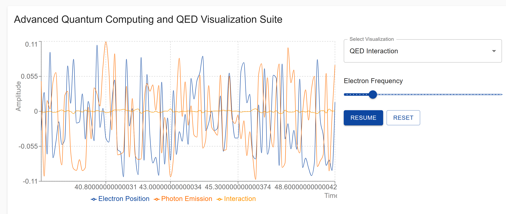

2. **Bloch Sphere**  
   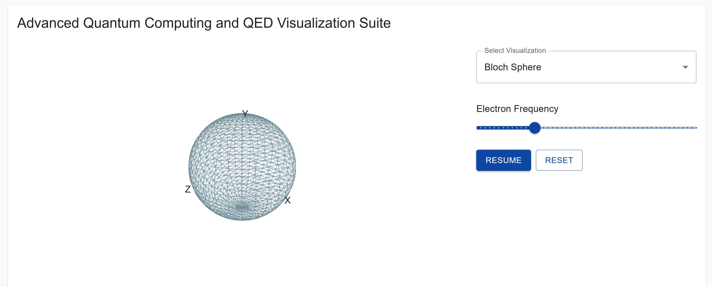

3. **Quantum Entanglement**  
   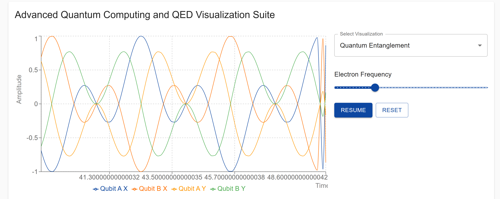

4. **Custom Quantum Circuit**  
   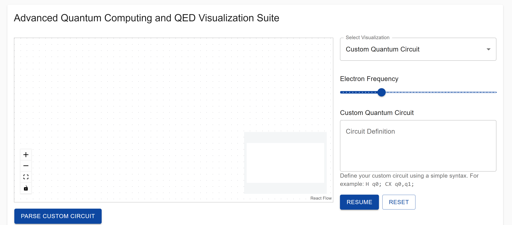

5. **Grover’s Algorithm**  
   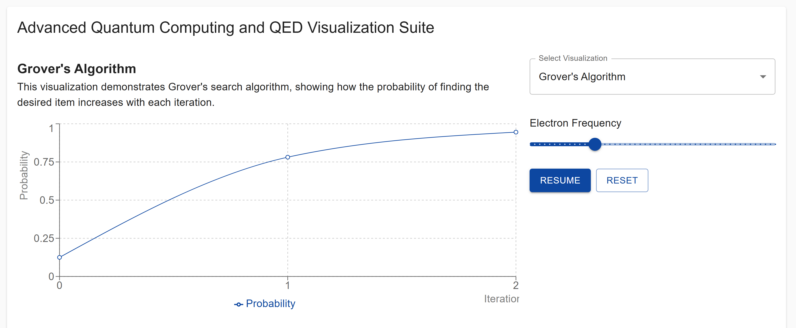

6. **Shor’s Algorithm**  
   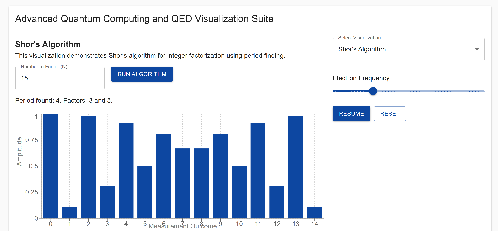

7. **Quantum Error Correction**  
   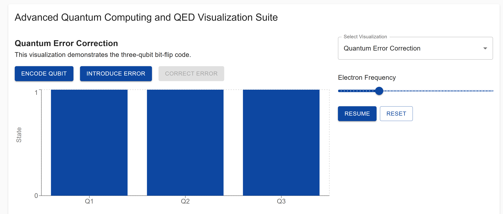

8. **Quantum Walk Simulation**  
   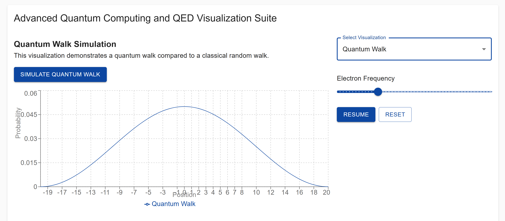

9. **Density Matrix Visualization**  
   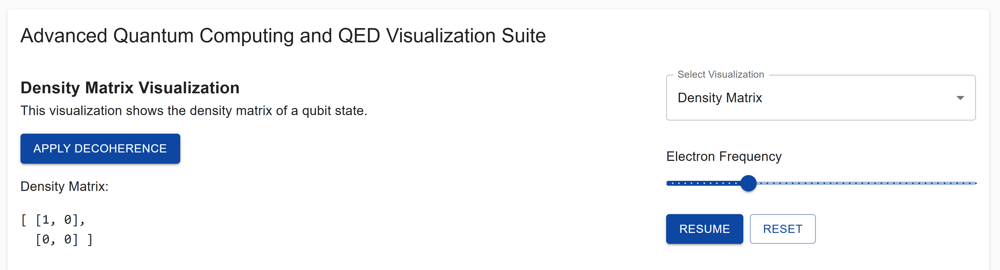

10. **Quantum Teleportation**  
    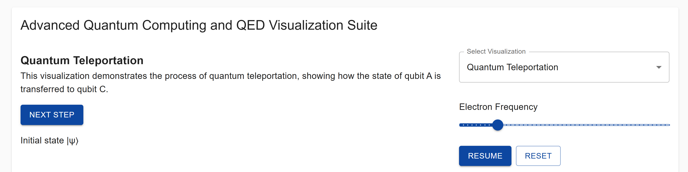

11. **Quantum Gate Simulator**  
    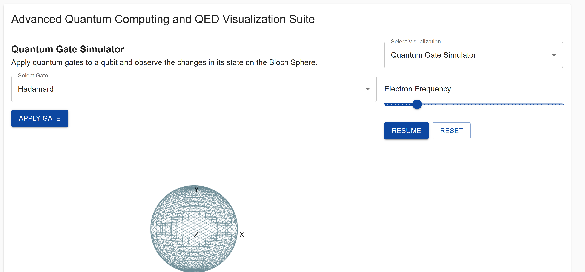

12. **Quantum Fourier Transform (QFT)**  
    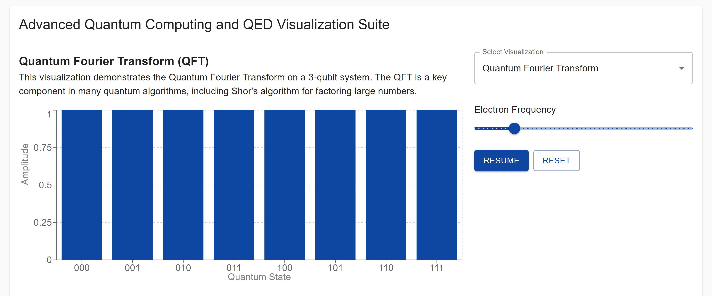

13. **Hamiltonian Evolution**  
    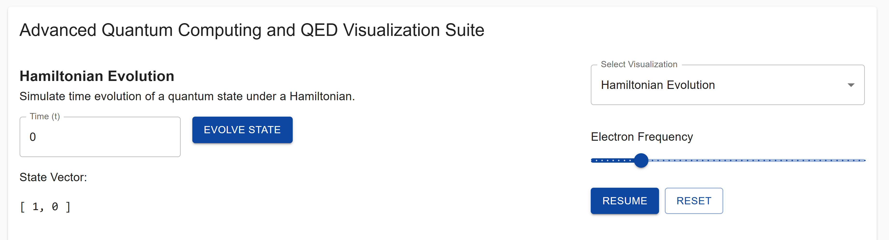

14. *(Optional)* **Updated Custom Quantum Circuit**  
    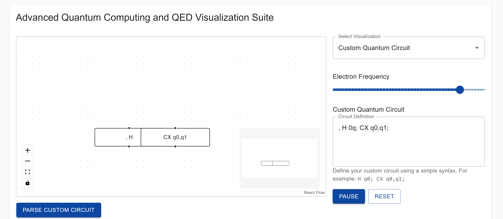

---

## Installation

1. **Clone this repository**:

   ```bash
   git clone https://github.com/your-username/quantum-qed-visualization.git
